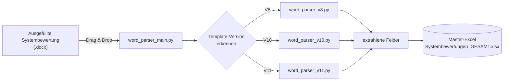
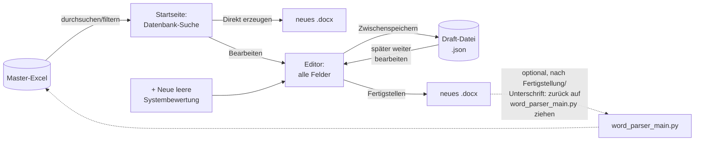

# SysBew_Extraktor

Extrahiert Daten aus Sanofi-Systembewertungen (Word, `.docx`, Templates
V7/V8/V10/V11) und trägt sie als neue Zeile in die zentrale
SharePoint-Master-Excel (`Systembewertungen_GESAMT.xlsx`, Sheet
`SysBew`, Excel-Tabelle `Tabelle1`) ein.

Diese Datei ist die einzige Dokumentation des Projekts – sie liegt im
Repo **und** wird unverändert mit in den produktiven Ordner kopiert
(siehe [Dateien zum Publizieren](#dateien-zum-publizieren--ordnerstruktur)).

Für eine detaillierte **Feld-für-Feld-Übersicht** (welche Felder gibt
es, kommen sie aus der Master-Excel oder nur aus dem Web-Editor, und
wo genau landen sie im erzeugten Word-Dokument) siehe
[FELDUEBERSICHT.md](FELDUEBERSICHT.md).

## Workflows (Übersicht)

Zwei unabhängige, gegenläufige Werkzeuge im selben Repo:


*Workflow 1 - Extraktion:* aus einer fertig ausgefüllten Systembewertung
wird eine Zeile in der Master-Excel.


*Workflow 2 - Erzeugung (Web-Editor, `webapp/`):* aus der Master-Excel
(oder komplett neu) wird eine NEUE Systembewertung erzeugt. Der
Rückweg in die Master-Excel läuft bewusst **nicht** direkt aus dem
Web-Editor, sondern über denselben geprüften Weg wie Workflow 1 -
erst das fertige, unterschriebene Dokument wird auf
`word_parser_main.py` gezogen (siehe Web-Editor-Abschnitt unten,
"WICHTIG (1.1)").

## Benutzung

Word-Datei auf **`word_parser_main.py`** ziehen (Drag & Drop) oder:

```
python word_parser_main.py "Systembewertung.docx"
```

Das ist der **einzige** Einstiegspunkt. Die Template-Version wird
automatisch erkannt und intern an das passende Erweiterungs-Modul
weitergereicht – es gibt keine Auswahl "welches Skript für welche
Version" mehr.

1. Word-Datei ist geschlossen (nicht in Word geöffnet).
2. Word-Datei per Drag & Drop auf `word_parser_main.py` ziehen.
3. Konsolenausgabe verfolgen – jeder Extraktionsschritt wird
   protokolliert, am Ende erscheint entweder `✅ In Master-Excel
   eingefügt (Zeile N)` oder eine Fehlermeldung mit Hinweis zur
   Behebung.
4. Bei "Master-Excel ist geöffnet/gesperrt": Datei in Excel schließen,
   dann ENTER drücken – das Skript versucht es erneut.
5. Bei "pywin32 ist nicht installiert": einmalig `pip install
   pywin32` ausführen.

## Arbeitsweise

1. Das Skript prüft zuerst die Template-Version des Dokuments:
   - **V8** = kein KI-Kapitel im Dokument
   - **V10** = KI-Kapitel vorhanden + Testtiefe als direkte
     Checkboxen/Text in Kapitel 2 ODER N/A bei "Vereinfachte
     Qualifizierung"
   - **V11** = "GAMP 5 (2nd Edition)" im Text ODER Testtiefe nur als
     Matrix in Kapitel 8

   **Sonderfall V7:** strukturell identisch zu V8 (kein KI-Kapitel,
   gleicher Tabellenaufbau) – einziger Unterschied sind SOP-Referenzen
   mit Standort-Präfix (z. B. `FRA-QU-SOP-...` statt `QU-SOP-...`).
   V7-Dokumente werden daher von der V8-Erweiterung verarbeitet. Die
   Spalte `Erkannte_Version` wird trotzdem korrekt mit `V7` befüllt,
   da zusätzlich der im Dokument selbst genannte Basis-Versionshinweis
   ausgelesen wird (`Neuerstellung auf Basis der ... Version 7.0` im
   Text der Tabelle "Version / Freigabedatum") – unabhängig von der
   strukturellen Versionserkennung, die weiterhin V8-Logik nutzt.
   *Bestätigt an den echten Master-Template-PDFs (Versionen 4.0–8.0):
   Versionen 4.0/5.0/6.0 sind die FRA-präfigierte Variante ("V7"),
   Version 8.0 die generische ("V8"); ab Version 5.0 wechselt zudem
   der Unterschriften-Vermerk von "siehe GEODE+" auf "siehe CMS".*

2. Alle relevanten Felder werden aus den Word-Tabellen extrahiert:
   Kopfdaten, Checkboxen (echte Word-Formularfelder **und**
   Klartext-Checkboxen `r`/`c` aus Seriendruck-Dokumenten),
   GxP-Klassifizierung, Klassifizierung (Lokal/Multi-Site/Global,
   inkl. Klasse 1a–3), Periodic Review, DI EE-Anforderungen,
   Testtiefe, Rollen/Namen vom Deckblatt (Ersteller/SME/SI-PL/TSO/
   BSO/BQR/CSQ), Kategorisierung, Historie usw.

3. Ergebnis wird in die Master-Excel geschrieben: neue letzte Zeile
   in `Systembewertungen_GESAMT.xlsx`, Sheet `SysBew`, Excel-Tabelle
   `Tabelle1` – per COM-Automatisierung durch ein im Hintergrund
   gestartetes echtes Excel (kein Neuschreiben der Datei). Dadurch
   bleiben Sensitivity-Label, externe Verknüpfung, Kommentare etc.
   unangetastet.

4. **Duplikat-Hinweis:** Nach dem Einfügen prüft das Skript, ob die
   Kombination aus "Dok. -Nr." und "Version" des neuen Eintrags
   bereits an anderer Stelle in der Master-Excel vorkommt, und gibt
   bei Fund eine Konsolen-Warnung aus. Rein informativ – verhindert
   das Einfügen nicht. Der Platzhalterwert `QU-OPE-xxxxx` wird dabei
   bewusst ignoriert.

5. **Spalte `Python ja/nein`:** wird automatisch mit `ja` befüllt,
   wenn die Zeile über dieses Skript eingetragen wurde. Manuell
   erfasste Zeilen bleiben unangetastet (leer/`nein`).

## Aufbau

| Datei | Zweck |
|---|---|
| `word_parser_main.py` | Einziger Drag-&-Drop-Einstiegspunkt. Erkennt die Template-Version und reicht an das passende Erweiterungs-Modul weiter. Liegt bewusst direkt im (öffentlichen) Ordner, nicht im Unterordner. |
| `lib/sysbew_common.py` | Gemeinsame Basis: Excel-Spalten, Master-Excel-Konfiguration, alle Hilfs- und Extraktionsfunktionen, die nicht vom Template-Aufbau abhängen, sowie das Schreiben in die Master-Excel per COM-Automatisierung. |
| `lib/word_parser_v8.py` | Erweiterung für Template V8 (und V7). |
| `lib/word_parser_v10.py` | Erweiterung für Template V10. |
| `lib/word_parser_v11.py` | Erweiterung für Template V11. |

Die drei Erweiterungs-Module sind reine Bibliotheksmodule ohne eigenes
Drag & Drop mehr – alle Aufrufe laufen ausschließlich über
`word_parser_main.py`. Sie liegen zusammen mit `sysbew_common.py` im
Unterordner `lib/`, damit im (öffentlichen) Hauptordner nur die eine
Datei sichtbar ist, auf die tatsächlich gezogen wird. `word_parser_main.py`
nimmt `lib/` beim Start selbst in den Python-Importpfad auf (`sys.path`)
– das muss beim Kopieren nicht händisch gemacht werden.

## Dateien zum Publizieren / Ordnerstruktur

Für den produktiven Einsatz müssen **`word_parser_main.py`, diese
README.md und der komplette Unterordner `lib/`** in den Zielordner
kopiert werden:

```
!Systembewertungen_CS\00_Serienbrief\
├── Systembewertungen_GESAMT.xlsx     (bereits vorhanden, nicht anfassen)
├── README.md                          <- diese Datei
├── word_parser_main.py                <- Drag & Drop-Ziel
└── lib\
    ├── sysbew_common.py
    ├── word_parser_v8.py
    ├── word_parser_v10.py
    └── word_parser_v11.py
```

Der Ordner ist öffentlich einsehbar - deshalb liegt im Hauptordner nur
`word_parser_main.py` (das eigentliche Drag-&-Drop-Ziel), die
restlichen vier Dateien liegen unauffälliger im Unterordner `lib/`.
Wird `lib/` versehentlich mitgezogen oder umbenannt, meldet
`word_parser_main.py` einen `ModuleNotFoundError` beim Start - dann
prüfen, ob der Ordner `lib/` noch direkt neben `word_parser_main.py`
liegt und exakt so heißt. Die drei
alten Einzelskripte (`word_parser_v8/v10/v11_formularfelder_vX.X.py`)
werden nicht mehr benötigt und sollten beim Update entfernt werden,
damit niemand versehentlich noch das alte, nicht mehr gepflegte
Skript benutzt.

## Web-Editor: neue Systembewertungen erstellen

Zweites, unabhängiges Werkzeug in diesem Repo (Ordner `webapp/`) - die
**Umkehrung** von `word_parser_main.py`: statt Daten AUS einer
Systembewertung IN die Master-Excel zu übernehmen, wird hier aus
Daten der Master-Excel (oder von Grund auf) eine NEUE Systembewertung
(V11) erzeugt.

**Start:** `python webapp/app.py` (oder Doppelklick auf
`webapp/Systembewertung_Editor_starten.bat`) - öffnet automatisch den
Browser auf `http://127.0.0.1:5151`. Läuft **lokal bei jeder/jedem
Nutzer:in**, kein zentraler Server nötig.

**Vier Arbeitswege:**
1. **Direkt übernehmen:** Auf der Startseite eine Zeile aus der
   Master-Excel suchen/filtern, "Direkt erzeugen" klicken -> sofort
   fertige Systembewertung als Download, ohne Zwischenschritt.
2. **Bearbeiten:** Wie 1, aber "Bearbeiten" statt "Direkt erzeugen" -
   öffnet einen Editor mit allen Feldern (Rollen, Kapitel 1, Kapitel 2
   Zusammenfassungstabelle, Beschreibungsfelder), vorausgefüllt mit
   den Daten der gewählten Zeile. Auch eine komplett leere
   Systembewertung ("+ Neue leere Systembewertung") ist möglich. Nach
   Änderungen "Fertigstellen" klickt das Dokument fertig.
3. **Aus Fill-a-Masterform-Import:** Für Systeme, die (noch) nicht in
   der eigenen Master-Excel stehen - siehe eigener Abschnitt
   "Fill-a-Masterform-Import" unten.
4. **Zwischenspeichern (Drafts):** Im Editor jederzeit
   "Zwischenspeichern" statt "Fertigstellen" - der Bearbeitungsstand
   landet als Draft im Ordner `Drafts/` neben der Master-Excel (selbes
   Netzlaufwerk, kein zusätzlicher Speicherort nötig) und kann über
   die Draft-Übersicht (`/drafts`) von **jeder Person, an jedem PC**,
   am nächsten Tag weiter bearbeitet werden.

**Wie ein Draft "fertig" wird:** Klickt man im Editor auf
"Fertigstellen" (statt "Zwischenspeichern"), wird 1) das .docx erzeugt
und zum Download angeboten, 2) der Draft-Status auf "fertig" (✅)
gesetzt - der Draft **verschwindet dabei nicht sofort** aus der
Draft-Übersicht, sondern bleibt dort sichtbar (jetzt mit dem Knopf
"Erneut herunterladen" statt "Öffnen zum Bearbeiten"), damit man das
Dokument bei Bedarf noch einmal ziehen kann. **30 Tage** nach dem
(letzten) Fertigstellen wird ein "fertig"-Draft automatisch gelöscht -
die eigentlichen Daten leben ab dem Fertigstellen ja bereits im
erzeugten Dokument, der Draft ist danach nur noch eine befristete
Sicherheitskopie. Drafts "in Bearbeitung" werden dagegen **nie**
automatisch gelöscht, egal wie alt.

Der Knopf "Fertigstellen" fragt deshalb vorher explizit nach ("Wirklich
jetzt fertigstellen?") - ein bereits heruntergeladenes/weitergegebenes
Dokument lässt sich danach nicht zurückholen, auch wenn der Draft
selbst technisch weiter geöffnet/erneut fertiggestellt werden kann.

**Vorschau statt gleich fertigstellen:** Der Knopf "👁️ Vorschau
erzeugen" erzeugt dasselbe Dokument zum Ansehen, **ohne** den Draft
abzuschließen - der Status bleibt "in Bearbeitung", die
30-Tage-Aufbewahrungsfrist startet also nicht. Damit ein
Vorschau-Dokument nicht mit dem finalen verwechselt wird: Dateiname
bekommt den Zusatz "_VORSCHAU", und das Dokument selbst hat ganz oben
einen deutlich sichtbaren roten Hinweis "VORSCHAU - NICHT FINAL".

**Mehrbenutzerfähigkeit ohne zentralen Server:** Es gibt keine feste
Anzahl an "Plätzen" - es werden so viele Draft-Dateien angelegt, wie
gerade gebraucht werden, beliebig viele Personen können gleichzeitig
an unterschiedlichen Drafts arbeiten. Damit sich niemand gegenseitig
überschreibt, wird ein Draft beim Öffnen mit einer Sperr-Datei
(`<id>.lock`, Name + Zeitstempel) markiert:
- Versucht jemand anderes denselben Draft zu öffnen, wird klar
  angezeigt, wer ihn gerade bearbeitet und seit wann - **nie eine
  stille Blockade ohne Erklärung**.
- Der Browser schickt alle 60 Sekunden einen Heartbeat, der die Sperre
  verlängert. Ohne Heartbeat (Tab geschlossen, PC abgestürzt) verfällt
  die Sperre nach 15 Minuten automatisch - der Draft wird dann von
  selbst wieder frei, ohne dass jemand manuell entsperren muss.
- Über "Sperre freigeben" im Editor kann man einen Draft auch bewusst
  vorzeitig wieder freigeben.

**Auto-Beenden:** Sobald kein Browser-Tab dieser App mehr offen ist,
beendet sich der lokale Server (und damit das schwarze Konsolenfenster)
automatisch - kein manuelles Schließen nötig, und kein unbemerkt
weiterlaufender Prozess im Hintergrund. Ein einzelner Seitenwechsel
innerhalb der App (z. B. Datenbank -> Editor) beendet dabei nichts;
erst wenn wirklich kein Tab mehr offen ist (oder der PC in den
Ruhezustand geht/die Verbindung länger abreißt), greift das
Zeitlimit. Bei einem echten Tab-Schluss reagiert das Beenden
innerhalb weniger Sekunden.

**Dok.-Nr. und Version in einem Feld:** Das Feld "Dok.-Nr. / Version"
erfasst beides zusammen (z. B. "QU-OPE-XXXXX / Version 1.0") - intern
weiterhin zwei getrennte Werte (Master-Excel-Spalte "Dok. -Nr." erhält
nur die reine Nummer), aber im Editor nur eine Eingabe statt zwei. Ohne
"/ Version ..." eingegeben, bleibt die Version unverändert (Standard
bei neuen Systembewertungen: "1.0").

Startet man eine neue Systembewertung aus einem Datenbank-Eintrag
(Weg 1 oder 2), wird "Dok.-Nr. / Version" bewusst **immer leer**
vorbelegt (Version auf "1.0", Datum auf heute, Historie-Text
geleert) - das ist ja ein neues Dokument mit eigener Identität, nicht
das alte unter neuem Datum. Die alte Dok.-Nr./Version geht dabei nicht
verloren, sondern wandert automatisch in das Feld "Vorherige Doc-ID".

Optional kann beim Fertigstellen die Checkbox "Auch in Master-Excel
eintragen" gesetzt bleiben - dann wird zusätzlich zum docx-Download
per COM-Automatisierung eine neue Zeile in die Master-Excel
eingetragen (derselbe Mechanismus wie bei `word_parser_main.py`,
inkl. `Python ja/nein = ja`).

**Template fest im System verankert:** Die Vorlage
(`assets/templates_docx/Systembewertung_V11_leer.docx`) liegt bewusst
als normale, sichtbare Datei im Repo - kein verstecktes/verschlüsseltes
Format, sie darf bei Bedarf angeschaut werden. Sie ist aber NICHT
einfach durch eine andere Datei ersetzbar: `template_filler.py` prüft
bei jedem Erzeugen per `detect_template_version()`, dass die Datei
tatsächlich V11 ist, und bricht sonst mit klarer Fehlermeldung ab. Es
gibt zu jedem Zeitpunkt **nur genau eine aktive Version** - kein
Auswahl-Dropdown, kein Fallback auf eine ältere Version. Sobald eine
V12-Vorlage benötigt wird, gilt **ausschließlich** noch diese; die
Umstellung (neue Datei + angepasste Fill-Funktionen für die neue
Struktur + `TEMPLATE_VERSION` in `lib/template_filler.py` hochsetzen +
Round-Trip-Test) erfolgt über eine Code-Änderung (Claude Code
hinzuziehen) - niemals durch bloßes Austauschen der Datei.

**Bekannte Einschränkung:** Kapitel 3 (Detailfestlegung Klasse
1a/1b), Kapitel 5-9 (Entscheidungsbaum Gerätekategorie/CS-Typ/ERES-Typ/
KI) und die Testtiefe-Matrix (Kapitel 8) werden **nicht** automatisch
befüllt - aus dem in der Master-Excel gespeicherten Endergebnis lässt
sich der zugrunde liegende Entscheidungsweg nicht eindeutig
rekonstruieren (mehrere Antwortpfade können zum selben Endergebnis
führen). Ein Raten wäre in einem GxP-Dokument nicht vertretbar - diese
Kapitel müssen nach dem automatischen Erzeugen manuell in Word
ergänzt werden. Alles, was auf dem Deckblatt und in der
Zusammenfassungstabelle (Kapitel 2) steht, wird dagegen vollständig
befüllt.

## Dekodierter Export (Prototyp für externe Tools)

`lib/export_dekodiert.py` ist ein **read-only Prototyp** für ein
Kollaborations-Szenario: andere Teams, die eigene Tools auf Basis der
Master-Excel bauen, müssten sonst das Wissen "welche Checkbox-Gruppe
ergibt welchen fachlichen Wert" (z. B. `GxP-C`/`GxP-M`/`GxP-m2`/
`GxP-NA` → "GxP-Kritikalität: Major") bei sich fest verdrahten - das
bricht stillschweigend bei jeder Spaltenänderung hier. Dieses Skript
löst pro Zeile alle bekannten Checkbox-Gruppen (über alle Template-
Versionen hinweg) zu je einem Klartext-Feld auf und lässt alle
übrigen (bereits lesbaren) Spalten unverändert.

```
python lib/export_dekodiert.py ausgabe.json --csv ausgabe.csv
```

Kein Live-System/keine laufende Schnittstelle - nur ein bei Bedarf neu
erzeugter, versionierter Datei-Export. Enthält ein Datenqualitäts-
Signal statt es zu verschleiern: ist bei einer eigentlich
"genau 1 erwartet"-Kategorie (z. B. GxP-Kritikalität) mehr als ein
Wert angekreuzt, erscheinen im Export **beide** Werte durch `"; "`
getrennt, statt dass einer davon stillschweigend verschwindet.

## Fill-a-Masterform-Import (Gegenstück zum dekodierten Export)

`lib/masterform_import.py` ist das Gegenstück zu
`export_dekodiert.py`: dort kodieren **wir** unsere Checkbox-Spalten
für andere Teams in Klartext, hier dekodieren wir umgekehrt einen von
"Fill-a-Masterform" bereitgestellten Klartext-Export (Excel, z. B.
`gxp_kritikalitaet: "Major"` statt Checkbox-Flags) wieder zurück in
unsere Checkbox-Felder, um daraus im Web-Editor eine **neue
Systembewertung** vorzubefüllen - dritter Arbeitsweg neben "aus der
eigenen Datenbank" und "von Grund auf" (siehe oben, `/masterform` im
Web-Editor).

Bewusst kein fest konfigurierter Netzwerkpfad wie bei der Master-Excel:
die Datei wird bei Bedarf im Browser hochgeladen, nur für diese eine
Anfrage gelesen und nirgends gespeichert (rein lesend, kein
Live-System). Genau wie beim dekodierten Export gilt: nichts wird
stillschweigend geraten. Werte, die sich nicht zweifelsfrei einer
Checkbox zuordnen lassen - unbekannte Ausprägungen, als "mehrfach
markiert" gekennzeichnete Kategorien, oder Felder ohne erkennbaren
Bezug zu einer unserer Checkboxen (`doku_status`,
`qualifizierung_erforderlich`, `validierung_erforderlich`) - werden
**nicht** automatisch ins Dokument übernommen, sondern als Hinweis im
Editor angezeigt, damit sie geprüft/manuell ergänzt werden können statt
unbemerkt zu verschwinden oder falsch gesetzt zu werden.

Da beide Seiten unabhängig voneinander weiterentwickelt werden, prüft
`masterform_import.py` beim Einlesen, ob die erwarteten Spalten noch
vorhanden sind, und warnt (bricht aber nicht ab), falls sich das
Schema beim anderen Team geändert hat.

**Vorlage zum Testen/Abstimmen:**
`assets/templates_xlsx/fill_a_masterform_vorlage.xlsx` enthält alle
erwarteten Spalten (Kopfzeile mit Zellkommentaren zu den jeweils
gültigen Werten, siehe `masterform_import.py`) sowie eine
Beispielzeile - damit lässt sich der Import (`/masterform`) ohne eine
echte Datei vom anderen Team testen, und die Datei kann auch als
Schema-Referenz für die Abstimmung mit "Fill-a-Masterform" dienen.

## Voraussetzungen

- Python ≥ 3.8 (getestet mit 3.12)
- `python-docx` (getestet mit 1.2.0), `pywin32` (getestet mit 312)
- Microsoft Excel lokal installiert (Master-Excel-Insert läuft per
  COM-Automatisierung) – nur unter Windows lauffähig

```
pip install python-docx pywin32
```

Für den Web-Editor (`webapp/`) zusätzlich:

```
pip install -r webapp/requirements.txt
```

(entspricht `flask`, `openpyxl`, plus die beiden oben genannten)

## Versionshistorie

### webapp/ (Web-Editor, neu)

- Erste Version: Startseite mit Datenbank-Filter (Weg 1: direkt
  erzeugen; Weg 2: im Editor bearbeiten), Editor mit allen Feldern
  der Systembewertung (Rollen, Kapitel 1, Kapitel 2), Draft-
  Zwischenspeicherung mit Sperr-Mechanismus (mehrbenutzerfähig, siehe
  Abschnitt "Web-Editor" oben).
- Neues Modul `lib/template_filler.py`: erzeugt aus einem Daten-Dict
  eine neue Systembewertung auf Basis von
  `assets/templates_docx/Systembewertung_V11_leer.docx` - Gegenstück
  zu den `extract_*`-Funktionen in `sysbew_common.py`. Per Round-Trip-
  Test (füllen -> mit dem bestehenden Extraktor wieder auslesen ->
  vergleichen) gegen die Extraktion abgesichert.
- Neue Module `lib/draft_store.py` (Draft-JSON + Sperr-Dateien im
  Ordner `Drafts/` neben der Master-Excel) und `lib/db_reader.py`
  (liest die Master-Excel per `openpyxl`, nur lesend, ohne COM).

### webapp/ - Überarbeitung nach erstem Praxistest

- **Schreibt nicht mehr in die Master-Excel.** Der Editor erzeugt nur
  noch das `.docx` zum Download; die Master-Excel wird ausschließlich
  über den bestehenden Weg (fertiges Dokument auf `word_parser_main.py`
  ziehen) befüllt - ein einziger Codepfad für die Excel-Befüllung.
- **Bugfix (Formatierung):** `template_filler.set_cell_text()`
  überschrieb bisher die komplette Zelle inkl. Formatierung (Schriftart
  wechselte auf Standard). Schreibt jetzt in den ersten bestehenden Run
  und behält dessen Formatierung.
- **Bugfix (Namens-Zusammenführung):** War nur "SME" ohne "SI/PL"
  angegeben, blieb der Platzhalter `<<Vorname Nachname>>` stehen und
  wurde fälschlich vor den SME-Namen gehängt (der Code las den noch
  unbefüllten Zellentext zurück statt den bekannten Datenwert).
- **Bugfix (Periodic Review):** Die Checkbox-Zelle hat 3 Optionen
  (QU-SOP-0007359 / QU-SOP-0028559 / freie Angabe), nicht 2 - die
  mittlere wurde übersehen, "PR_Andere" zeigte fälschlich auf
  QU-SOP-0028559 statt auf die freie Angabe. Neue Spalte `PR_SOP2`,
  neues Freitext-Feld `PR_Andere_Text` für die freie Angabe.
- Kapitel 3 (Systemeinstufung Globales CS), 6 (ERES-Typ), 7 (GAMP5-
  Kategorie) und 9.1 (KI-Einsatz Ja/Nein) werden jetzt automatisch mit
  denselben Werten befüllt wie die Zusammenfassungstabelle (Kapitel 2) -
  vorher blieben diese Kapitel leer, obwohl die Information bereits
  vorlag.
- Testtiefe (Kapitel 2 + Z-Felder-Matrix in Kapitel 8) wird jetzt
  automatisch aus GxP-Kritikalität + GAMP5 Software-Kategorie berechnet
  (`template_filler.fill_testtiefe`) - keine manuelle Nacharbeit mehr
  nötig.
- Neue webapp-only Zusatzfelder (nicht Teil der Master-Excel-Spalten):
  Abteilung je Rolle (ersetzt den Platzhalter "(Site/Unit)" im
  Deckblatt), "ERES-Typ 4 – Art der Signatur" (3 Checkboxen aus
  Kapitel 6).
- Grund der Systembewertung (Kapitel 1, neben Neuerstellung/Änderung)
  wird jetzt ebenfalls mit dem Wert aus "Historie" befüllt (vorher nur
  in der Dokumentenhistorie-Tabelle).
- Feld "Besonderheiten": wird an den vorhandenen Hinweistext der Zelle
  angehängt statt ihn zu ersetzen.
- "Steuerung erfolgt über?" hat keine eigene Frage im Template und
  wird nicht mehr separat abgefragt, sondern der Prozessbeschreibung
  vorangestellt, falls befüllt.
- Die 4 generischen `BemerkungX`-Spalten haben laut Fachbereich eine
  feste Bedeutung (Bemerkung1=Prozessbeschreibung, 2=Daten, 3=Audit
  Trail, 4=Parameter) - werden im Editor entsprechend beschriftet, in
  der Anzeige zum Kapitel "Informationen und Bemerkungen" gruppiert und
  beim Erzeugen an die jeweilige Zeile angehängt.
- Phenix-Nummern und "DI EE-Anforderungen" werden im Editor nicht mehr
  abgefragt (Phenix existiert laut Fachbereich nicht mehr; DI EE-
  Anforderungen lässt sich ohne den Entscheidungsbaum aus Kapitel 5
  nicht verlässlich ableiten).
- Layout: Felder stehen platzsparend im Raster nebeneinander statt
  untereinander, jedes Feld/jede Kategorie hat einen Hinweistext, jeder
  Themenbereich hat einen eigenen "Zwischenspeichern"-Knopf,
  Textbaustein-Vorschläge (v. a. für PLS-Systeme) für alle Felder aus
  Kapitel 2 "Informationen und Bemerkungen" (Prozessbeschreibung,
  Daten, Parameter, Alarme, Chargenprotokoll, Audit Trail,
  Benutzerverwaltung, Schnittstellen mit PLS, Angeschlossenes
  Equipment, Sonstiges, KI Bewertung) sowie für "Historie" (Grund der
  Erstellung) und "Besonderheiten".
- Zwei weitere, bisher fehlende Felder ergänzt (beide mit
  Textbaustein-Vorschlägen):
  - **"Schnittstelle"** (Zusammenfassungstabelle Kapitel 2) bekommt
    dieselben Schnittstellen-Typ-Vorlagen wie "Schnittstellen mit
    PLS" - beide Felder beschreiben denselben Sachverhalt (kurz vs.
    ausführlich).
  - **"Datenfluss / Abbildung"** (Zeile 8 der Beschreibungstabelle,
    bisher nie abgefragt, da sie im Template primär eine Grafik
    erwartet) direkt hinter "Schnittstellen mit PLS" ergänzt - Grafiken
    können hier nicht erzeugt werden, dafür aber ein Verweistext.
- Zwei weitere Web-Editor-only-Felder ergänzt:
  - **"CSQ - Abteilung"**: ersetzt das im Template standardmäßig fest
    eingetragene "(FBC Quality Q&V CSV)" im CSQ-Label, falls
    ausgefüllt - ohne Eingabe bleibt der Standardtext unverändert.
  - **"Begründung (optional)"** direkt unter "Systemtyp
    (Zugangsbeschränkung)": das Template selbst hat dafür nur bei
    "N/A" einen festen Beispieltext ("mechanische Ausrüstung"), hier
    wird eine Begründung für jede Auswahl angeboten und als
    zusätzliche Zeile angehängt.
- Draft-Titel: MLCS-ID wird dem Systemnamen vorangestellt (z. B.
  "MLCS-1193 - PLS Lantus"), sofern vorhanden.
- **Offene Fragen** (siehe "Bekannte Einschränkungen"): Bedeutung von
  `PLSTA` und von "VV" bei "SW-Version / Typ:" ist nicht dokumentiert.

### webapp/ - Fill-a-Masterform-Import (dritte Startquelle)

- Neues Modul `lib/masterform_import.py`: liest einen von
  "Fill-a-Masterform" bereitgestellten, dekodierten Excel-Export
  (Gegenstück zu `export_dekodiert.py`, siehe eigener Abschnitt oben)
  und übersetzt ihn zurück in unsere Checkbox-Felder, um daraus im
  Editor eine neue Systembewertung vorzubefüllen.
- Neue Route `/masterform` (Datei-Upload, nur für die eine Anfrage
  gelesen, nirgends gespeichert) + `/masterform/bearbeiten` (legt
  daraus einen Draft an, analog zu "Bearbeiten" bei einer
  ML-Zeile) - neue Startseiten-Kachel "📥 Aus Fill-a-Masterform-Export
  starten".
- Nicht zweifelsfrei einer Checkbox zuordenbare Werte (unbekannte
  Ausprägungen, als "mehrfach markiert" gekennzeichnete Kategorien,
  `doku_status`/`qualifizierung_erforderlich`/`validierung_erforderlich`
  ohne erkennbaren Checkbox-Bezug) werden als Hinweis im Editor
  angezeigt statt automatisch (und ggf. falsch) übernommen zu werden.

### Bugfix: leer gelassene Felder liessen Anleitungstext im Dokument stehen

- **Fehlerbild**: Wurde ein Freitextfeld (z. B. "Audit Trail (AT)",
  "Angeschlossenes Equipment", aber auch Rollen-Namen, MLCSID,
  Hersteller, "Grund der Systembewertung" usw.) im Editor leer
  gelassen, blieb im erzeugten Dokument nicht etwa eine leere Zelle
  stehen, sondern der interne Anleitungs-/Beispieltext des Leer-
  Templates (z. B. die komplette, unbeantwortete Frage "<Werden Audit
  Trail Daten generiert...>" oder "<<Vorname Nachname>>") - `template_
  filler.py` hat die jeweilige Zelle bisher nur beschrieben, WENN ein
  Wert vorhanden war (`if data.get(...): set_cell_text(...)`), statt
  sie bei fehlender Angabe bewusst zu leeren.
- **Fix**: alle betroffenen Stellen (Deckblatt-Rollen, Kapitel-1-
  Textfelder, Zusammenfassungstabelle, GxP-Begründung, komplette
  Beschreibungstabelle "Informationen und Bemerkungen") rufen
  `set_cell_text()` jetzt immer auf - leere Felder werden dadurch
  tatsächlich leer, wie es die restliche Dokumentation ohnehin schon
  beschrieb ("Alles, was auf dem Deckblatt und in der
  Zusammenfassungstabelle steht, wird vollständig befüllt").
- Zusätzlicher Bugfix in `set_cell_text()` selbst: Platzhaltertexte,
  die zweizeilig sind (z. B. "Bezeichnung des Equipments/
  Systemname:") oder einen Hyperlink enthalten (z. B. der Verweis auf
  "QU-MT-0001344" in der Dokumentenhistorie-Zeile), liessen bisher
  eine leere zweite Zeile bzw. ein Hyperlink-Textfragment übrig -
  zusätzliche Absätze werden jetzt komplett entfernt statt nur
  geleert, und alle `<w:t>`-Textknoten der Zelle werden direkt per XML
  geleert (nicht nur über `Paragraph.runs`, das Hyperlink-Runs nicht
  erfasst).
- Kapitel 1, Tabelle "Grund der Systembewertung": der linke Rand der
  zweiten Spalte war im Leer-Template mit einem negativen Einzug
  versehen (Text ragte über die Spaltengrenze hinaus) - auf 0
  korrigiert.
- Getestet: Round-Trip über alle 733 Zeilen einer echten
  Fill-a-Masterform-Beispieldatei (0 Fehler), gezielte Vorher/Nachher-
  Prüfung der betroffenen Zellen mit teils leeren, teils befüllten
  Daten.

### Main-Datei + Erweiterungen (aktuelle Architektur)

- Umbau der drei bisher eigenständigen Skripte
  (`word_parser_v8/v10/v11_formularfelder`) in eine gemeinsame Basis
  (`sysbew_common.py`) + drei schlanke Erweiterungsmodule + eine
  einzige Main-Datei (`word_parser_main.py`) mit automatischer
  Versionserkennung.
- Neue Funktion `extract_deckblatt_rollen()`: liest die Namen zu
  Ersteller/SME/SI-PL/TSO/BSO/BQR/CSQ von der Deckblatt-
  Unterschriftentabelle. "Projektleiter/SME" ist im Dokument teils
  eine kombinierte Rolle (Name landet dann in beiden Spalten SI/PL
  und SME – erkannt auch, wenn das Label nur "SME" lautet, aber der
  Bestätigungstext der Folgezeile "Projektleiter/SME" nennt).
  Unbekannte Funktionsbezeichnungen fallen auf SME zurück, außer sie
  deuten auf Projektleitung hin (→ SI/PL). Mehrfachnennungen (z. B.
  zwei BSO) werden mit Zeilenumbruch in einer Zelle zusammengeführt.
- Bugfix (bereits im Vorgänger-Code vorhanden, jetzt behoben): die
  Zelle "Ersteller"/"Autor" wurde von `extract_text_fields()` über
  einen zu laschen Teilstring-Vergleich fälschlich als Treffer für
  "Hersteller / SW-Ersteller / Lieferant" gewertet und übernahm die
  Nachbarzelle als Hersteller-Wert. Die Deckblatt-Rollentabelle wird
  jetzt davon ausgeschlossen.
- Drei bisher komplett unextrahierte Bereiche ergänzt (gegen echte
  Dokumente verifiziert):
  - **DI EE-Anforderungen** (P1–P4/N/A) – war in der
    Zusammenfassungstabelle Kapitel 2 zwischen Testtiefe und
    Gerätekategorie schlicht übersprungen worden.
  - **Periodic Review gemäß** (QU-SOP-0007359 / freie Angabe /
    zyklische Requalifizierung) – eigene Zeile in derselben Tabelle,
    bisher komplett ungemappt.
  - **Klassifizierung** aus Kapitel 1 (Lokales CS / Multi-Site-CS
    inkl. nur lokal/lokal und global / Globales CS inkl. Klasse
    1a/1b/2/3 / Equipment ohne CS).
  - Neue Spalte `Python ja/nein`: wird automatisch mit `ja` befüllt.
- Spaltenname `SI` auf `SI/PL` korrigiert (entsprach nicht dem
  echten Master-Excel-Spaltenkopf).
- Konsolen-Vorschau (`📊 EXTRAHIERTE DATEN`) überarbeitet:
  - Rohe Checkbox-Werte `r`/`c` werden als `ja`/`nein` angezeigt.
  - Gruppierbare Checkbox-Felder (z. B. GxP-Kritikalität,
    Klassifizierung, DI EE-Anforderungen, ERES-Typ, ...) erscheinen
    als eine Zeile mit dem/den ausgewählten Wert(en) statt als
    Einzelfelder.
  - Reihenfolge und Gliederung folgen jetzt dem Template: die
    Ausgabe ist in Abschnitte unterteilt (Deckblatt – Rollen,
    Deckblatt – Identifikation, Deckblatt – Beschreibung/Hersteller,
    Kapitel 1, Kapitel 2 – Zusammenfassungstabelle, Kapitel 2 –
    Systembeschreibung, Sonstiges, Dokumentenhistorie), jeweils mit
    eigener Überschrift statt einer alphabetischen Gesamtliste. Ein
    Abschnitt erscheint nur, wenn er tatsächlich befüllte Felder
    enthält.
  - `Systemtyp_CE` zeigt bei allen CS-Typen außer LCE/PCS/EE jetzt
    `-` statt `nein` an (ist nur ein abgeleitetes Merkmal, keine
    eigenständig gestellte Ja/Nein-Frage - bei CIS/S0-S2/N/A schlicht
    nicht einschlägig).

### word_parser_v10_formularfelder (Vorgänger-Skript, bis 1.8)

- **1.0** Erste stabile Version. Text-Checkbox-Erkennung (Klartext
  `r`/`c` aus Seriendruck-Dokumenten) als Fallback zu echten
  Word-Formularfeld-Checkboxen (SDT). Neue Spalte `Erkannte_Version`.
  Direktes Einfügen als neue Zeile in die Master-Excel statt eigener
  Excel-Datei. Umstellung von openpyxl auf COM-Automatisierung, um
  Master-Excel-Struktur (Excel-Tabelle, Sensitivity-Label, externe
  Verknüpfung) nicht zu beschädigen. MLCS-ID: Präfix "MLCS" wird
  entfernt.
- **1.1** Neue Felder `Version`, `Offen`/`Geschlossen`/`NA`,
  `UeberlagerteMLCS`. Bugfix: Namenskonflikt zwischen Testtiefe-N/A
  und Kapitel-1-Systemtyp-N/A behoben.
- **1.2** Bugfix "Version": höchste Version über ALLE Zeilen der
  Tabelle ermittelt, nicht nur die erste.
- **1.3** Duplikat-Hinweis nach dem Einfügen.
- **1.4** Bugfix MLCSID: Präfix "MLCS ID" wird korrekt entfernt.
- **1.5** Bugfix COM-Lifecycle: `excel.Quit()` nur noch, wenn das
  Skript selbst eine neue Instanz gestartet hat.
- **1.6** Gesundheitscheck für angehängte Excel-Instanz (verwaiste
  Prozesse, "OLE error 0x800a01a8").
- **1.7** Automatische Wiederholung bei transienten COM-Fehlern
  (z. B. RPC_E_DISCONNECTED durch OneDrive/SharePoint-Sync).
- **1.8** Konsolen-Block "VALIDIERUNG: Vollständigkeitsprüfung" für
  11 Checkbox-Kategorien.

`word_parser_v11_formularfelder` (2.0–2.8) und
`word_parser_v8_formularfelder` (1.0–1.10) durchliefen dieselben
Bugfixes/Erweiterungen parallel; V11 berechnet die Testtiefe
zusätzlich aus der Z-Felder-Matrix in Kapitel 8 statt aus einer
direkten Zelle in Kapitel 2, V8 erkennt zusätzlich den Sonderfall V7
über `extract_template_basis_version()`.

## Bekannte Einschränkungen

- Bei der Fehlermeldung "OLE error 0x800a01a8" ("Object required"):
  im Task-Manager nach hängenden, unsichtbaren EXCEL.EXE-Prozessen
  suchen und diese beenden, dann erneut versuchen. Das Skript prüft
  dies zwar automatisch vor dem Schreibvorgang, ein manueller Check
  schadet im Zweifel aber nicht.
- Die Vollständigkeitsprüfung (VALIDIERUNG-Block) zeigt bei
  Dokumenten mit "GxP-Relevanz = Nein" für alle nachfolgenden
  Kategorien "❗ KEIN Wert ausgewählt" an, da die Systembewertung laut
  Formularlogik dort vorzeitig endet. Das ist KEIN Fehler, sondern
  erwartet.
- Testtiefe (Gering/Mittel/Hoch) und Validierung/Qualifizierung nach
  SOP (QUAL/VAL) sind bewusst NICHT Teil der Vollständigkeitsprüfung,
  da beide Gruppen aktuell nicht alle im Dokument vorhandenen
  Checkbox-Optionen vollständig auf Excel-Spalten abbilden (fehlende
  Testtiefe-N/A-Spalte, fehlende 3. SOP-Spalte QU-SOP-0028559 bei
  Validierung/Qualifizierung) – eine Prüfung würde dort zu falschen
  Warnungen führen.
- Externe Verknüpfungen in der Master-Excel werden beim Öffnen per
  COM bewusst NICHT automatisch aktualisiert (`UpdateLinks=0`), um
  Störungen durch Verknüpfungs-Dialoge zu vermeiden.
- Die Deckblatt-Rollen- und Klassifizierungs-Extraktion wurde gegen
  echte V11-Dokumente verifiziert; für V8/V10 liegen aktuell nur die
  leeren Master-Template-PDFs zum Strukturabgleich vor, noch keine
  echten ausgefüllten Dokumente zum End-to-End-Test.
- **webapp/**: Kapitel 5 (Entscheidungsbaum Gerätekategorie/CS-Typ,
  Tabellen 9-10) wird nicht automatisch befüllt - der zugrunde
  liegende Antwortweg lässt sich aus dem Endergebnis nicht eindeutig
  rekonstruieren und muss nach dem Erzeugen manuell in Word ergänzt
  werden.
- **webapp/**: Bedeutung des Feldes `PLSTA` ist nicht dokumentiert (in
  keinem der Vorgänger-Skripte befüllt) - wird im Editor mit
  entsprechendem Warnhinweis angezeigt, aber inhaltlich nicht
  aufgelöst.
- **webapp/**: Bedeutung von "VV" und den weiteren dort üblichen
  Optionen beim Feld "SW-Version / Typ:" ist nicht dokumentiert -
  Feld bleibt frei ausfüllbar, mit entsprechendem Warnhinweis.
- **webapp/**: Die ERES-Typ-4-Unterfrage "Art der Signatur" hat im
  tatsächlichen Leer-Template nur 3 Checkboxen (Identifikation und
  Passwort / Biometrisch / Token und Passwort) - die zusätzlichen
  Optionen "eSignature ohne/mit GxP-Bezug" aus einer anderen
  Quelle/Version wurden im Template nicht gefunden und daher nicht
  umgesetzt.
